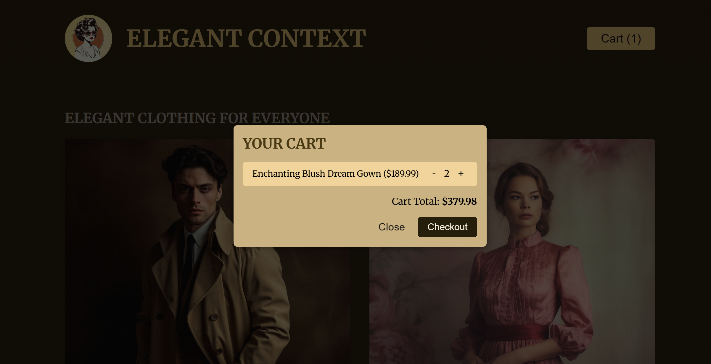

### Project Overview: Demo Shop App – Refactoring Prop Drilling

This is a **pre-built demo Shop application** initially structured using **prop drilling** to manage state and data flow.

In this section, the app was refactored to demonstrate two key improvements:

- **Replacing prop drilling** with the **React Context API** for cleaner and more maintainable state sharing across components.
- **Using `useReducer`**: The app originally managed cart and product interactions using a **single `useState` object**. For demonstration, the state logic was refactored using `useReducer` to handle updates in a more structured way.

---

### Concepts Covered

- Prop drilling (before refactor)
- Context API for global state management
- `useReducer` for centralized and cleaner update logic
- Organizing state transitions with action types and a reducer function

