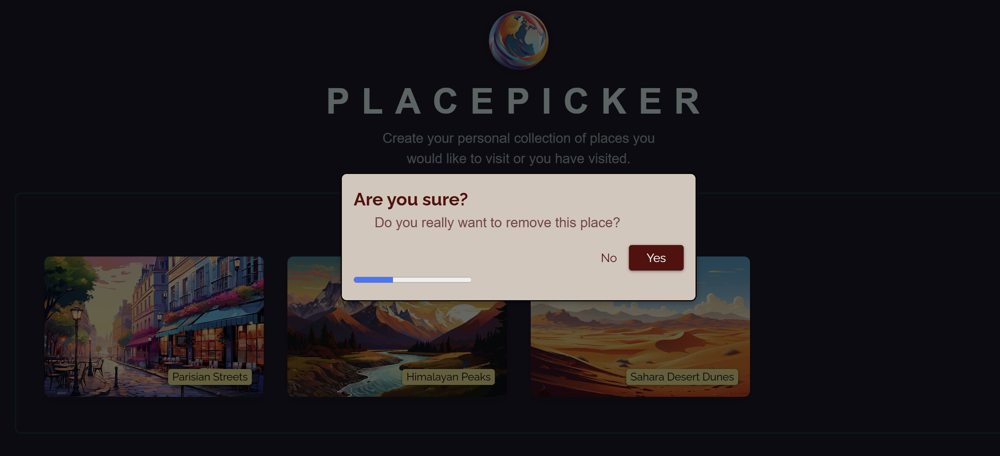

### Project Overview: Place Picker with Timed Delete Modal

This project explores the various uses of **`useEffect`** in React through a place picker application.

#### Key learnings and features:

1. **Avoiding infinite loops**  
   Handling state updates within asynchronous operations to prevent infinite re-renders.

2. **Synchronizing React state/props with DOM APIs**  
   Using `useEffect` to control native DOM elements, such as opening and closing a modal via `dialog.current.showModal()` and `dialog.current.close()`.

3. **Cleaning up timers**  
   Properly clearing timers to avoid memory leaks or unintended behavior.

4. **Use of dependencies and cleanup functions**  
   Understanding when and how to use dependencies in `useEffect`, and how to clean up side effects correctly.

5. **Use of `useCallback`**  
   Optimizing performance by memoizing functions passed to child components.

---

#### Application behavior:

* Users can select places from a list to add to their “To Go” list.  
   
  
   
  
* Clicking on a place in the “To Go” list opens a **delete confirmation modal**.  
* The modal includes a timer: if the user does not respond within the time limit, the place is automatically removed.  
   
  
* Users can cancel the deletion by clicking “No” before the timer expires or confirm deletion by clicking “Yes”.
