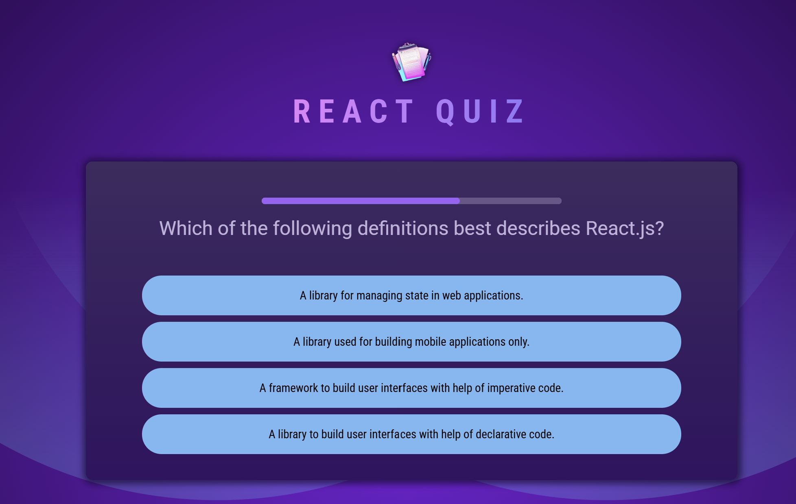
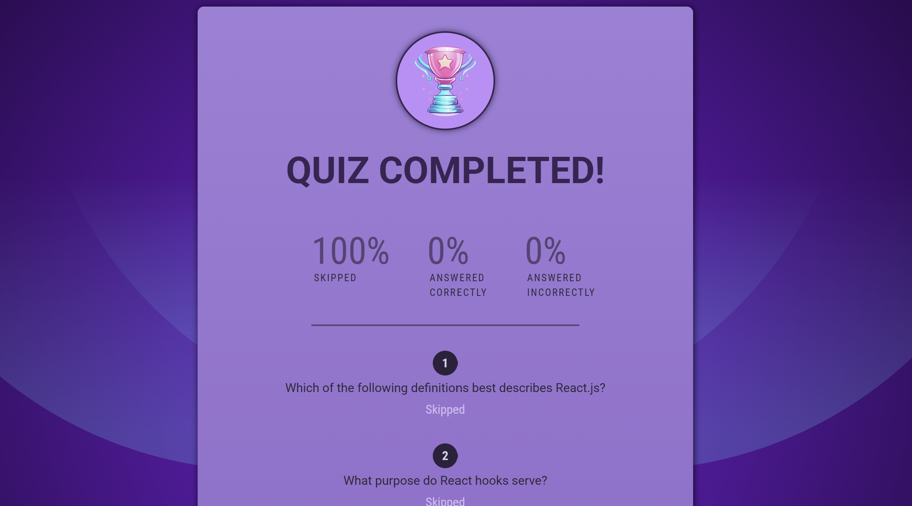

### Project Overview: Responsive Quiz Application

This is a **responsive quiz application** built from scratch using React. It presents a set of timed multiple-choice questions, tracks user performance, and displays a detailed scoreboard at the end.

---

#### Features:

- Answer timed multiple-choice questions  
   
  
   

- Skip questions if unsure

- Final scoreboard showing:  
   
  
   
  - Percentage of correct, wrong, and skipped answers  
  - Detailed review of each question with the user’s answers
