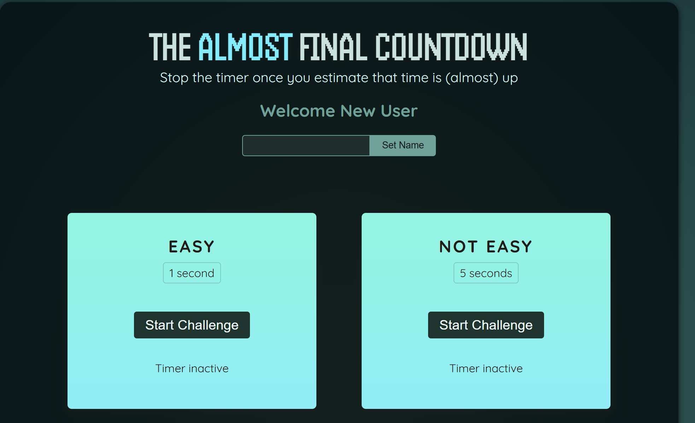
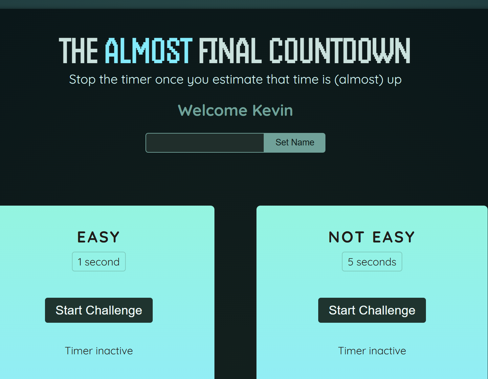
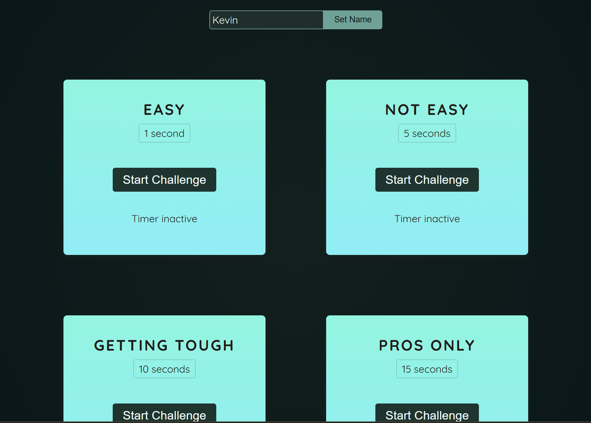
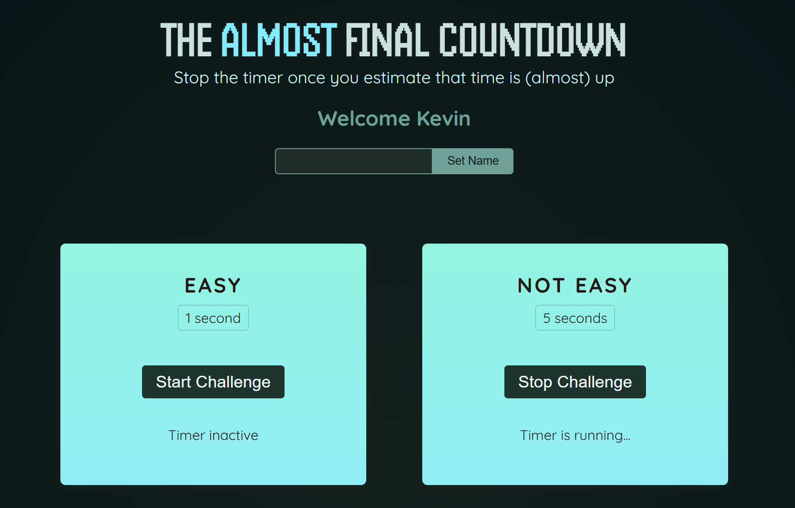
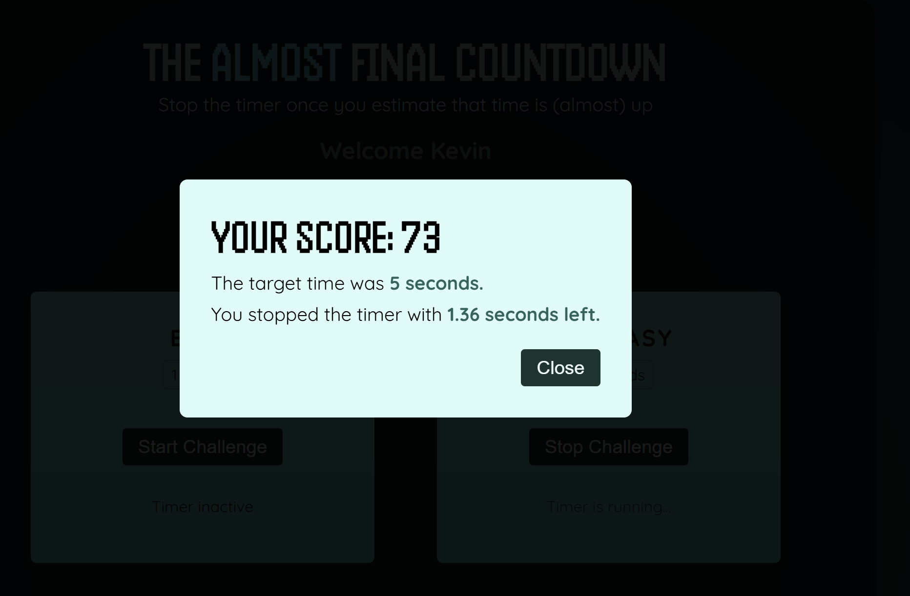
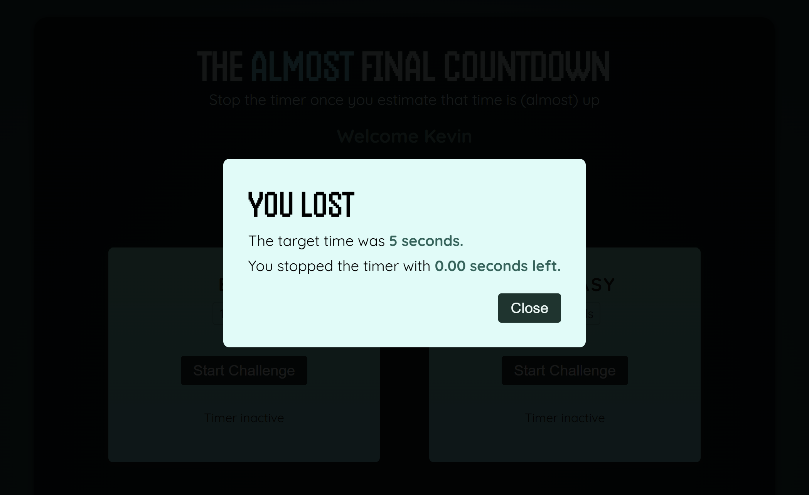

### Project Overview: Timer Challenge Game

This project was built to explore and understand the concepts of **`useRef`**, **`useImperativeHandle`**, and **`createPortal`** in React. This is a fun timer challenge game where users can:

* Enter their **name**
  
  
* Choose a timer (1s, 5s, 10s, or 15s)
  
* Start the **challenge** and try to stop it **as close as possible** to the timer end
  

#### Game Rules:

* Stop the challenge **before** the timer ends to **win**
* Your score is based on **how close** you stop to the exact time
  
* If you go over time, you **lose**
  
* After the round ends (win/lose), a **scoreboard modal** is displayed

---

### React Concepts Used

* **`useRef`** – to create/ track the timer
* **`useImperativeHandle`** – to expose methods of modal component
* **`createPortal`** – to render the scoreboard modal at the top of the component hierarchy

