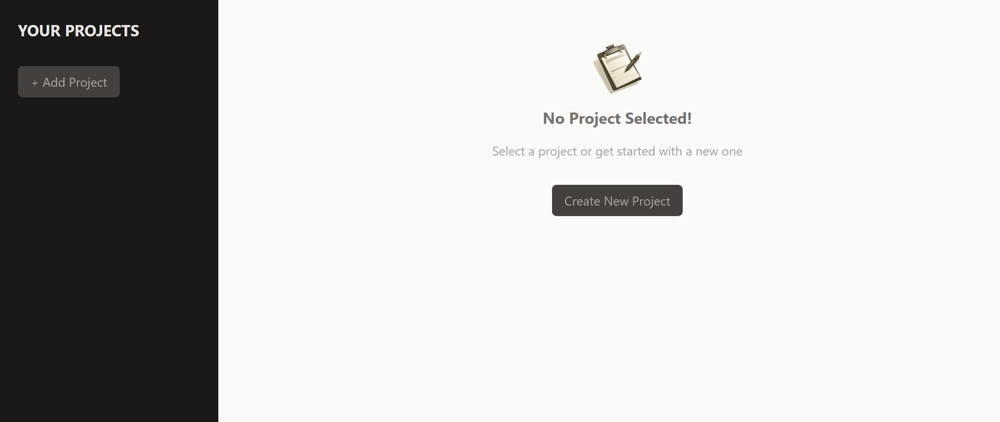
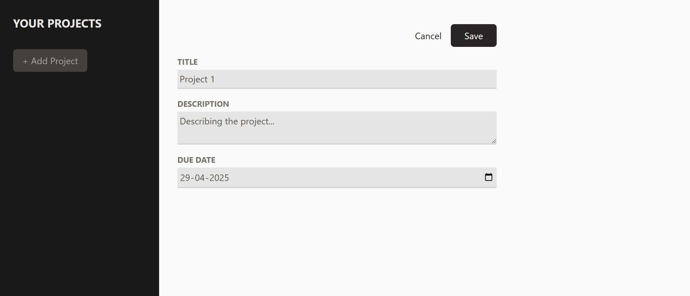
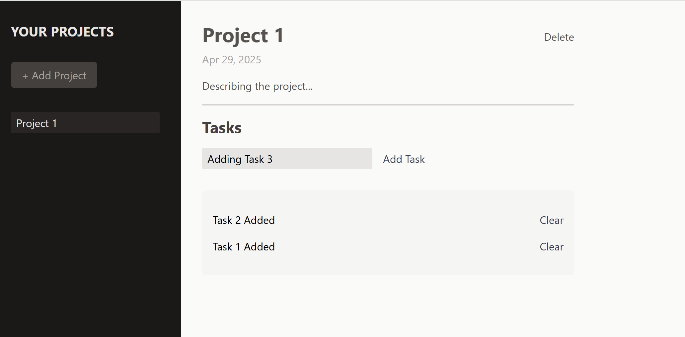
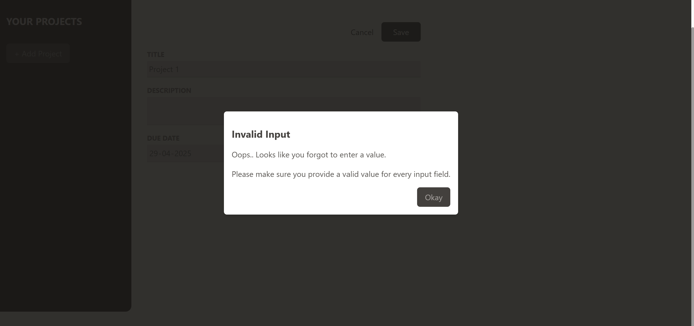

### Project Overview: Basic Project & Task Manager

This project is a **basic project & task manager**, built to understand the fundamentals of managing state, nested data structures, and component interaction in React.

---

#### Features

- **Create and delete projects**  
  Each project includes a **title**, **description**, and **due date**  
  

- **Add and delete tasks** within each project  
  

- **Form validation** with error feedback using a modal  
  

---

### Concepts Covered

- Component-based architecture
- Props and state management
- Refs and `useImperativeHandle`
- Error modals using portals
- List rendering and dynamic updates
- **Uncontrolled form inputs** using `useRef` (vs. controlled inputs)
